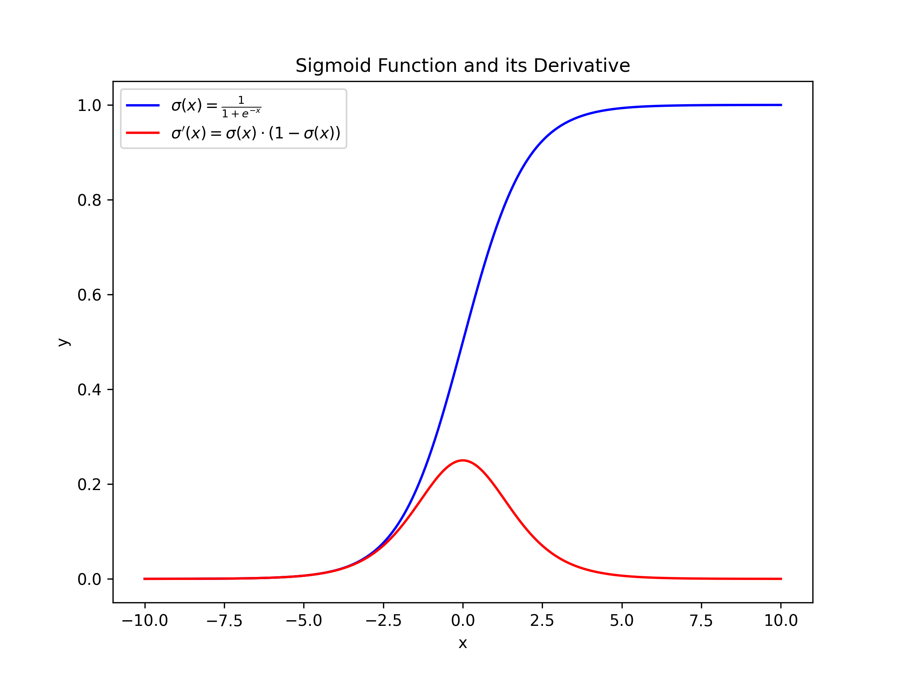
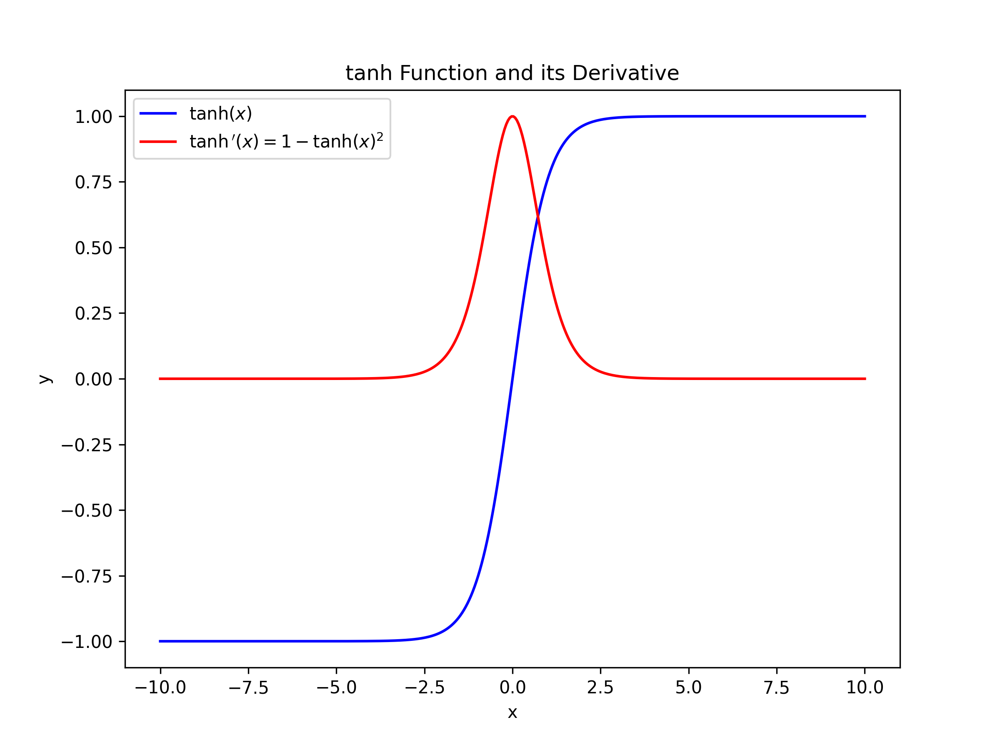
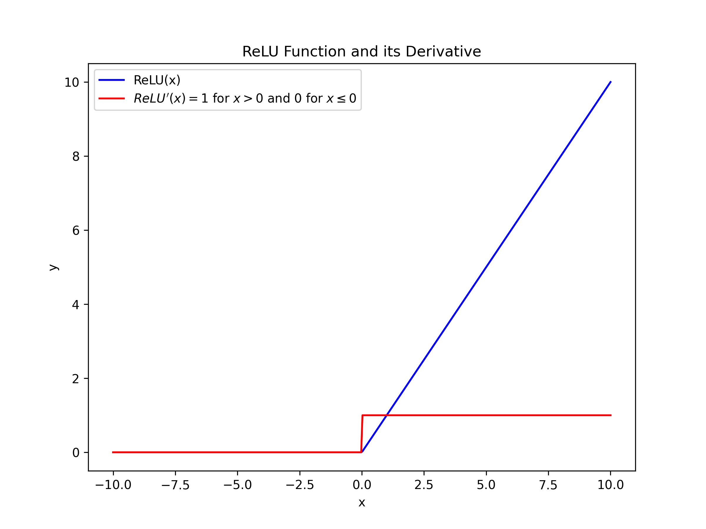
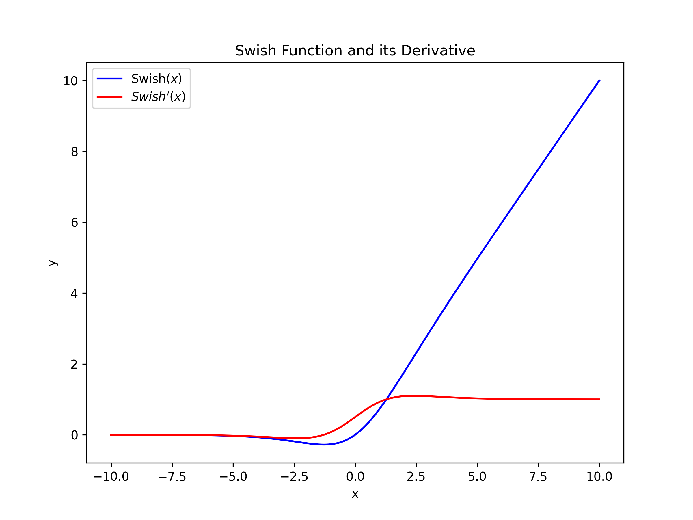
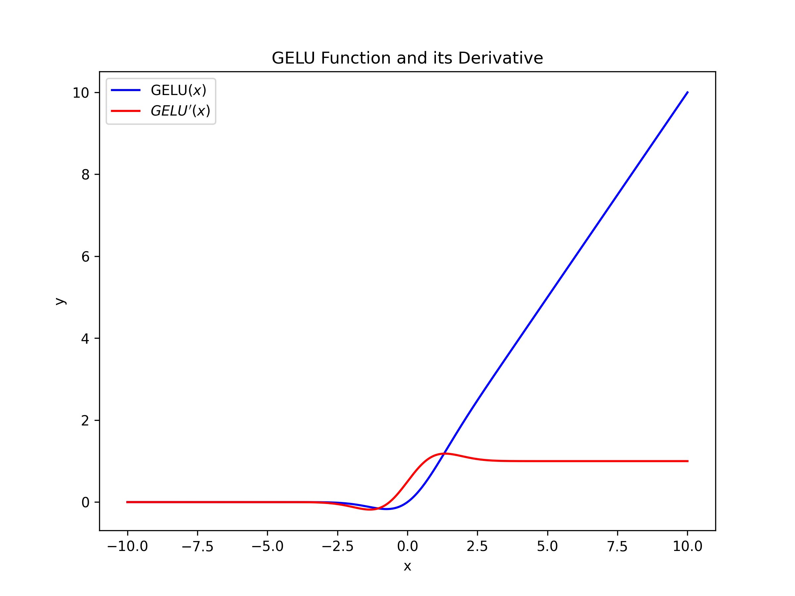

> ## Pytorch

$e^x=2$，你是什么模型\( e^x = 2 \)

### 常用操作与内存相关
$$e^x=2$$
- view() 返回的新tensor与源tensor共享内存，也即更更改其中的一个，另外⼀个也会跟着改变
- 返回拷贝用 clone， 创造⼀个副本然后再使用 view
- item() , 它可以将⼀个标量 Tensor 转换成⼀个Python number
- 当对两个形状不同的 Tensor 按元素运算时，可能会触发⼴播（broadcasting）机制：先适当复制元素使这两个 Tensor 形状相同后再按元素
  运算。例如：
- y = x + y 这样的运算是会新开内存的，然后将 y 指向新内存， 可用id()来判断内存地址是否相同， 防止重新开辟内存方法： 可用 `y[:] = y + x`, `torch.add(x, y, out=y)`, ` y += x`, `y.add_(x)`

---

### tensor 和 numpy相互转换

***设a为tensor, b为numpy***

- tensor转numpy: `b= a.numpy()`
- numpy转tensor: `a = torch.from_numpy(b)`
- 这两个函数所产生的的 Tensor 和NumPy中的数组共享相同的内存（所以他们之间的转换很快），改变其中一个时另⼀个也会改变！！！
- `torch.tensor()`：从数据创建⼀个Tensor。这将复制数据，即原始数据和返回的Tensor不共享内存。`

---

### Tensor 在CPU和GPU间相互移动

- 判断是否有GPU：`torch.cuda.is_available()`
- `device = torch.device("cuda")`, `tensor.to(device)`：指定设备（如"cuda:0"或"cuda:1"）来将Tensor移动到GPU上。
- `tensor.to('CPU')`, `tensor.to('cuda')`：将Tensor移动到CPU或GPU上。

---

### 自动求梯度

将某Tensor的属性.requires_grad 设置为 True，可以调用 .backward() 来完成所有梯度计算。此 Tensor 的梯度将累积到 **.grad** 属性中。
注意在 y.backward() 时，如果 y 是标量，则不需要为 backward() 传⼊任何参数；否则，需要
传⼊⼀个与 y 同形的 Tensor

- ` x = torch.ones(2, 2, requires_grad=True)`, 像x这种直接创建的称为叶子节点(x.is_leaf为true)，叶⼦子节点对应的 grad_fn 是 None 。
- 如果是通过其他操作得到的，例如相加, 则 `grad_fn=<AddBackward>`
- `x.requires_grad_(True)` 来用in-place的方式改变 requires_grad 属性

> ## 梯度

```python
import torch
x = torch.ones(2, 2, requires_grad=True)
y = x + 2
z = y * y * 3
out = z.mean()
out.backward()
print(x.grad)
```

- 注意求均值后相当于是一个标量对一个向量或求矩阵求导，也就是用该标量对其中的每个元素/分量求导，均值可以写成

$\text{out} = \frac{1}{n} \sum_{i=1}^n z_i= \frac{1}{n}(z_1+z_2+z_3+z_4)$, 所以就是用out分别对这四个分量求导，所以每个的导数都是$\frac{1}{n}$

### 梯度推导

#### 问题描述

已知如下公式：

$$
x = \begin{bmatrix} 1 & 1 \\ 1 & 1 \end{bmatrix}
$$

$$
y = x + 2
$$

$$
z = y^2 \cdot 3
$$

$$
\text{out} = \frac{\text{sum}(z)}{\text{numel}(z)}
$$

目标是求：

$$
\frac{\partial \text{out}}{\partial x}
$$

---

#### 1. 从最后一步开始

我们知道：

$$
\text{out} = \text{mean}(z)
$$

因此：

$$
\text{out} = \frac{1}{n} \sum_{i=1}^n z_i
$$

其中 \(n = 4\) 是矩阵的元素总数。对于任意 \(z_i\)：

$$
\frac{\partial \text{out}}{\partial z_i} = \frac{1}{n} = 0.25
$$

---

#### 2. 对 \(z\) 进行求导

由于：

$$
z_i = 3 \cdot y_i^2
$$

对 \(y_i\) 求导得：

$$
\frac{\partial z_i}{\partial y_i} = 6 \cdot y_i
$$

---

#### 3. 对 \(y\) 进行求导

因为：

$$
y_i = x_i + 2
$$

对 \(x_i\) 求导为：

$$
\frac{\partial y_i}{\partial x_i} = 1
$$

---

#### 4. 链式法则

利用链式法则，可以将梯度链起来：

$$
\frac{\partial \text{out}}{\partial x_i} = \frac{\partial \text{out}}{\partial z_i} \cdot \frac{\partial z_i}{\partial y_i} \cdot \frac{\partial y_i}{\partial x_i}
$$

代入上述结果：

$$
\frac{\partial \text{out}}{\partial x_i} = 0.25 \cdot (6 \cdot y_i) \cdot 1 = 1.5 \cdot y_i
$$

由于：

$$
y_i = x_i + 2
$$

所以：

$$
\frac{\partial \text{out}}{\partial x_i} = 1.5 \cdot (x_i + 2)
$$

---

#### 5. 结果计算

在代码中：

$$
x = \begin{bmatrix} 1 & 1 \\ 1 & 1 \end{bmatrix}
$$

$$
y = x + 2 = \begin{bmatrix} 3 & 3 \\ 3 & 3 \end{bmatrix}
$$

因此：

$$
\frac{\partial \text{out}}{\partial x} = 1.5 \cdot y = 1.5 \cdot \begin{bmatrix} 3 & 3 \\ 3 & 3 \end{bmatrix} = \begin{bmatrix} 4.5 & 4.5 \\ 4.5 & 4.5 \end{bmatrix}
$$

---

#### 验证代码

运行代码后，梯度结果如下：

```python
tensor([[4.5, 4.5],
        [4.5, 4.5]])
```

- 普通的梯度下降：`x -= lr * x.grad`
- 优化器方式：

```python
import torch
import torch.optim as optim

# 定义初始变量
x = torch.ones(2, 2, requires_grad=True)

# 定义优化器，这里使用 SGD（随机梯度下降）
optimizer = optim.SGD([x], lr=0.1)  # 学习率设置为 0.1

# 进行前向传播
y = x + 2
z = y * y * 3
out = z.mean()

# 清空梯度
optimizer.zero_grad()

# 反向传播
out.backward()

# 打印梯度
print("梯度 (x.grad):")
print(x.grad)

# 执行一步优化器的参数更新
optimizer.step()

# 打印更新后的参数值
print("更新后的参数值 (x):")
print(x)
```

输出：

```
更新后的参数值 (x):
tensor([[0.5500, 0.5500],
        [0.5500, 0.5500]], requires_grad=True)
```

- **grad在反向传播过程中是累加的，这意味着每⼀次运⾏反向传播，梯度都会累
加之前的梯度，所以⼀般在反向传播之前需把梯度清零, 方法:**
  
  1. 在backward()前用`optimizer.zero_grad()`
  2. x.grad.data.zero_()

---

### `detach()`与`torch.no_grad()`

- **`detach()`** 会返回一个新的张量，这个新张量与原始张量共享内存（数据部分），但它不再是计算图的一部分，已经从计算图中分离，不会再参与后续的反向传播计算。减少了不必要的计算图构建，从而减少内存占用和计算开销。
- `torch.no_grad()` 是一个上下文管理器，作用范围是 ​**禁用在该上下文中的所有操作的梯度计算**​。它非常适合在 **推理阶段** 使用，或者在训练过程中临时禁用梯度计算以节省计算资源。

---

### 梯度下降

在每一次迭代中，梯度下降使⽤用整个训练数据集来计算梯度，因此它有时也被称为批量梯度下降
（batch gradient descent）。⽽随机梯度下降(SGD)在每次迭代中只随机采样⼀个样本来计算梯度。我们还可以在每轮迭代中随机均匀采样多个样本来组成一个⼩批量，然后使⽤这个小批量来计算梯度(mini-batch SGD)。一般实际用的都是这种，***之后提到的梯度都指的是小批量的梯度均值：***

$$
g_t = \frac{1}{m} \sum_{i=1}^{m} \nabla_{x} f(x; x_i)
$$

- ​**梯度是函数在某一点的切线斜率**​，它指向函数值上升最快的方向

> ## 优化器

### mini-batch SGD

```python
import torch

# 假设有一个简单的模型
model = torch.nn.Linear(10, 2)

# 使用 SGD 优化器
optimizer = torch.optim.SGD(model.parameters(), lr=0.001)
```

#### **1. 公式**

$$
x_{t+1} = x_t - \eta \cdot g_t
$$

其中：

- $x_t$ 是参数在第 $t$ 次迭代时的值。
- $\eta$ 是学习率（Learning Rate）。
- $g_t$ 是在小批量数据上的梯度，计算公式为：

$$
g_t = \frac{1}{m} \sum_{i=1}^{m} \nabla_{x} f(x; x_i)
$$

其中：

- $m$ 是小批量的大小。
- $x_i$ 是第 $i$ 个训练样本。
- $\nabla_{x} f(x; x_i)$ 是样本 $x_i$ 对参数 $x$ 的梯度。

通过不断迭代更新 $x$，小批量梯度下降可以有效地逼近目标函数的最小值。

- 问题：对于输入向量的不同分量，损失函数对于不同分量可能具有不同的梯度，而由于更新所有分量时采用的都是同样的学习率，这就会使得学习率小时对于梯度大的分量才能很好收敛到最优解，但却会使得梯度小的分量的方向收敛缓慢

### 动量法（momentum）

```python
import torch

# 假设有一个简单的模型
model = torch.nn.Linear(10, 2)

# 使用带动量的 SGD 优化器
optimizer = torch.optim.SGD(model.parameters(), lr=0.001, momentum=0.9)
```

#### 1. 公式

$$
v_{t} = \gamma v_{t-1} + \eta g_t
$$

$$
x_{t} = x_{t-1} -  v_t
$$

其中：

- $x_t$ 是参数在第 $t$ 次迭代时的值。
- $v_t$ 是第 $t$ 次迭代的速度（动量项）, 最开始为0。
- $g_t$ 是当前迭代的小批量梯度。
- $\eta$ 是学习率（Learning Rate）。
- $\gamma $ 是动量的衰减系数，通常取值接近于 1（如 0.9）。
- $y_{t} = \gamma y_{t-1} + (1-\gamma )x_t$， $y_{t}$可以看作是对最近$\frac{1}{1-\gamma}$个时间步的 $x_t$值的加权平均, 且离当前时间步越近的$x_t$值获得的权重越大（越接近1）,所以对于动量公式， $v_t$ 可以看作收最近$\frac{1}{1-\gamma}$个时间步的 $\frac{\eta}{1-\gamma}g_t$ 值的加权平均

下面的代码可以验证该动量法的公式，结果与手动推导一致

```python
import torch
import torch.optim as optim

# 创建一个 requires_grad=True 的 Tensor
x = torch.ones(2, 2, requires_grad=True)

# 创建优化器并设置动量
optimizer = optim.SGD([x], lr=0.1, momentum=0.9)


# 定义一个简单的损失函数
def loss_function(x):
    y = x + 2
    z = y * y * 3
    return z.mean()


# 进行多次迭代，观察动量的影响
for epoch in range(1, 6):
    optimizer.zero_grad()  # 每次迭代前清零梯度
    out = loss_function(x)  # 计算损失
    out.backward()  # 反向传播，计算梯度

    print(f"Epoch {epoch}:")
    print(f"  x.grad = {x.grad}")  # 打印当前的梯度
    print(f"  x = {x}")  # 打印当前的参数

    optimizer.step()  # 更新参数
    print(f"  Updated x = {x}\n")
```

#### 2. 优点

在每次更新时，动量项累积了之前的梯度，导致每次参数的更新不仅仅依赖于当前的梯度，还受到之前梯度的影响，即过去的梯度在⽅向上是否一致， 从而达到了加速收敛，减小振荡的作用。

#### 3. 缺点

各个维度上的学习率仍然是相同的，只是依赖指数加权移动平均使得⾃变量的更新方向更加一致，从⽽降低发散的可能，加快收敛

### AdaGrad

```python
import torch

# 假设有一个简单的模型
model = torch.nn.Linear(10, 2)

# 使用 Adagrad 优化器 
optimizer = torch.optim.Adagrad(model.parameters(), lr=0.001)
```

#### 1. 公式

初始化梯度累积项 $s_t = 0$

$$
s_t = s_{t-1} + g_t \odot g_t
$$

$$
x_{t} = x_{t-1} - \frac{\eta}{\sqrt{s_t + \epsilon}} \odot g_t
$$

- 这⾥的开方、除法和乘法的运算都是按元素运算的
- $\eta$：初始学习率。
- $\odot$: 按元素乘
- $\epsilon$：平滑项，避免除以零（通常 $\epsilon = 10^{-8}$）。
- $s_t$：历史梯度平方的累积，用于调整学习率。

#### 2. 优点

AdaGrad根据历史梯度平方的累积调整自变量在各个维度上的学习率，自动适应不同参数方向的变化，从⽽避免统⼀的学习率难以适应所有维度的问题，特别适合稀疏数据和特征。**

#### 3. 缺点

随着累积梯度平方的不断增大，学习率会一直减小，可能导致优化停滞。

### RMSProp

```python
import torch

# 假设有一个简单的模型
model = torch.nn.Linear(10, 2)

# 使用 RMSprop 优化器
optimizer = torch.optim.RMSprop(model.parameters(), lr=0.001, alpha=0.9) # alpha 是衰减率（滑动平均系数）
```

#### 1. 公式

$$
s_t = \gamma s_{t-1} + (1-\gamma) g_t \odot g_t
$$

$$
x_{t} = x_{t-1} - \frac{\eta}{\sqrt{s_t + \epsilon}} \odot g_t
$$

- 这⾥的开方、除法和乘法的运算都是按元素运算的
- $\eta$：初始学习率。
- $\odot$: 按元素乘
- $\epsilon$：平滑项，避免除以零（通常 $\epsilon = 10^{-8}$）。
- $s_t$：历史梯度平方的累积，用于调整学习率。

**RMSProp与和AdaGrad的不同在于AdaGrad的$s_t$是截至时间步t的所有$g_t$的按元素平方和，RMSProp算法将这些梯度按元素平方做指数加权移动平均**， 所以$s_t $可以看作是最近$\frac{1}{1-\gamma}$个时间步的小批量随机梯度平方
项 $g_t \odot g_t$值的加权平均。

#### 2. 优点

自变量每个元素的学习率在迭代过程中不再⼀直降低（或不变）。

#### 3. 缺点

~

### Adam

```python
import torch

# 假设有一个简单的模型
model = torch.nn.Linear(10, 2)

# 使用 Adam 优化器（没有显式设置 weight_decay）
optimizer = torch.optim.Adam(model.parameters(), lr=0.001)
```

#### Adam算法可以看做是RMSProp算法与动量法的结合, 使用了动量变量$v_t$和RMSProp算法中小批量随机梯度按元素平方的指数加权移动平均变量$s_t$

#### 1. 公式

$$
v_t = \beta_1 v_{t-1} + (1-\beta_1) g_t
$$

$$
s_t = \beta_2 s_{t-1} + (1-\beta_2) g_t \odot g_t
$$

- 偏差修正: 为了抵消动量和二阶矩在初期的零初始化导致的偏差（因为都乘了$1-\beta$），避免出现学习率过低的问题，提升了优化器的初期收敛速度和整体效率。

$$
\hat{v}_t = \frac{v_t}{1-\beta_1 ^t}
$$

$$
\hat{s}_t = \frac{s_t}{1-\beta_2 ^t}
$$

$$
g_{t}'=\frac{\eta}{\sqrt{s_t + \epsilon}} \hat{v}_t
$$

$$
x_{t} = x_{t-1} - g_{t}'
$$

相当于就是用RMSProp进行自适应各维度的学习率，用动量来利用历史梯度

#### 2. 优点

Adam算法在RMSProp算法的基础上对⼩批量随机梯度也做了指数加权移动平均。

#### 3. 缺点

~

### AdamW

```python
import torch

# 假设有一个简单的模型
model = torch.nn.Linear(10, 2)

# 使用 AdamW 优化器（显式设置 weight_decay）
optimizer = torch.optim.AdamW(model.parameters(), lr=0.001, weight_decay=0.01)
```

**Adam** 和 **AdamW** 都使用了权重衰减（L2 正则化），但它们在如何加正则化和加在哪里上有所不同。关键区别如下：

#### **Adam：**

在 Adam 中，权重衰减项（L2 正则化）是 **在计算梯度时直接加到梯度上**，影响了梯度的方向。梯度计算公式如下：

$$
\text{gradient} = \nabla_{x} \mathcal{L} + \lambda x
$$

其中，$\lambda x$ 是正则项。这意味着梯度和正则化项是 **混合** 在一起的。

#### **AdamW：**

在 AdamW 中，权重衰减是 **独立于梯度** 的。正则化项并不改变梯度，而是在 **更新参数时单独加到参数上**：

$$
x_{t} = x_{t-1} - g_{t}' - \eta \lambda x_{t-1}
$$

这样，梯度更新和权重衰减是 **解耦** 的。权重衰减只在参数更新时被加上，而不是与梯度一起混合。

### **总结区别：**

- **Adam**：正则化项通过修改梯度直接影响更新过程。
- **AdamW**：正则化项作为独立步骤，在梯度更新后单独影响参数，而不混合在梯度计算中。

这样，AdamW 更符合标准的 L2 正则化定义，避免了 Adam 中权重衰减影响梯度计算导致的偏差。
注意手动在损失函数中加入正则同时Adam中不用权重衰减也不是理论上的正则，也会影响梯度计算，所以用AdamW

### 优化器总结

`动量法`结合前一步的梯度修改梯度（改梯度）， `AdaGrad`利用各维度的历史梯度平方和来自适应各维度的学习率（改学习率），`RMSProp`将历史梯度平方和做了指数加权移动平均（改学习率），`Adam`结合了`动量法`和`RMSProp`（即改梯度也改学习率）, `AdamW`的梯度更新和权重衰减是 **解耦** 的, 更符合标准的L2正则化定义，避免了`Adam`中权重衰减影响梯度计算导致的偏差。

> ## 激活函数

作用

1. ​**引入非线性增强网络表达能力**​：通过激活函数，神经网络能够表达输入和输出之间的非线性关系，从而能拟合复杂的函数。如果没有激活函数，神经网络就仅仅是一个线性变换的堆叠,因此，激活函数赋予神经网络强大的表达能力。
2. ​**限制输出范围**​：某些激活函数（如 Sigmoid 和 Tanh）将输出限制在一个特定的范围内，这对于某些任务可能非常有用（如概率预测等）。
3. 常用：Sigmoid、Tanh、ReLU、Leaky ReLU、Swish、GELU、GLU、 SwiGLU、GeGLU
### sigmoid

#### 1. 公式

- 定义：

$$
\sigma(x) = \frac{1}{1 + e^{-x}}
$$

- 导数：

$$
\sigma'(x) = \sigma(x) \cdot (1 - \sigma(x))
$$

#### 2. 图像



* 函数值域：（0，1）
* 导数值域：（0，0.25）

#### 3. 优点

- 输出在(0,1)之间，输出范围有限，优化稳定，可以用作输出层，如二分类问题中的概率估计。
- 连续函数，便于求导。

#### 4. 缺点

- **梯度消失问题**：当输入值过大或过小时，Sigmoid 函数的梯度会接近于 0，导致反向传播时梯度更新变得非常慢，影响训练效率。
- **非零中心**：Sigmoid 函数的输出值不对称，始终大于零（输出范围是(0, 1），这可能导致训练过程中的偏移
- **计算复杂度高**， 涉及指数运算
---

### tanh

#### 1. 公式

- 定义：

$$
\tanh(x) = \frac{e^x - e^{-x}}{e^x + e^{-x}}
$$

- 导数：

$$
\tanh'(x) = 1 - \tanh^2(x)
$$

#### 2. 图像



* 函数值域：（-1，1）
* 导数值域：（0，1）

#### 3. 优点

- **0均值**，有助于加快训练过程。输出在 (-1, 1) 之间，且是零中心的（即均匀分布在正负值之间）
- 比 Sigmoid 函数更有效地避免了梯度消失问题，尤其是在输入值不大或不小时。
- 连续函数，便于求导。

#### 4. 缺点

- **梯度消失问题**：虽然相较于 Sigmoid，tanh 在某些区域能够提供更大的梯度，但当输入值较大或较小时，梯度仍然会接近于 0。
- **计算复杂度高**：与 Sigmoid 函数类似，tanh 也涉及指数运算，计算成本较高。
---

### ReLU

#### 1. 公式

- 定义：

$$
\text{ReLU}(x) = \max(0, x)
$$

- 导数：

$$
\text{ReLU}'(x) = \begin{cases} 
1 & \text{if } x > 0 \\
0 & \text{if } x \leq 0 
\end{cases}
$$

#### 2. 图像



* 函数值域：$[0, \infty)$
* 导数值域：$\{0, 1\}$

#### 3. 优点

- **计算简单**，ReLU 仅需要计算最大值，因此相比其他激活函数（如 Sigmoid 和 Tanh），计算量较小，能加速网络训练。
- **有效避免梯度消失问题**：在正区间，ReLU 的梯度恒为 1，有助于加速训练过程。
- **稀疏激活**：对于负值输入，ReLU 输出为 0，这有助于神经网络的稀疏性，提高网络的计算效率。

#### 4. 缺点

- **死神经元问题**：当输入为负值时，ReLU 的输出始终为 0，这可能导致部分神经元在训练过程中“死亡”（即它们的输出始终为 0，无法更新），从而影响网络的表现。
- **不对称性**：ReLU 输出总是非负的，无法处理负数输入，因此可能导致一些不对称的问题。
---

### Swish

#### 1. 公式

- 定义：

$$
\text{Swish}(x) = x \cdot \sigma(x) = \frac{x}{1 + e^{-x}}
$$

- 导数：

$$
\text{Swish}'(x) = \sigma(x) + x \cdot \sigma'(x) = \sigma(x) \cdot (1 + x \cdot (1 - \sigma(x)))
$$

#### 2. 图像



* 函数值域：$(-\infty, \infty)$
* 导数值域：$(0, \infty)$

#### 3. 优点

- **平滑性**：Swish 函数具有平滑的曲线，避免了 ReLU 可能引起的不连续问题，尤其有助于训练深层网络。
- **避免梯度消失**：由于其平滑特性，Swish 在大部分区间内都能提供有效的梯度，避免了梯度消失问题。
- **学习能力强**：相比于 ReLU，Swish 可以在负数区间输出非零值，这有助于神经网络学习到更多的特征。

#### 4. 缺点

- **计算开销较大**：与 ReLU 等简单激活函数相比，Swish 的计算涉及到 Sigmoid 函数，增加了计算复杂度。
- **未完全解决负值问题**：尽管 Swish 函数在负数区间提供了非零输出，但对于输入极小的值（负值较大时），输出仍然会趋近于 0，可能无法完全避免死神经元问题。
- 

---

### GELU

#### 1. 公式

- 定义：

$$
\text{GELU}(x) = 0.5 x \left( 1 + \tanh \left( \sqrt{\frac{2}{\pi}} (x + 0.044715 x^3) \right) \right)
$$

- 近似形式：

$$
\text{GELU}(x) \approx 0.5 x \left( 1 + \tanh \left( 0.797885 \cdot x \right) \right)
$$

- 导数：

$$
\text{GELU}'(x) = 0.5 \left[ \tanh \left( \sqrt{\frac{2}{\pi}} (x + 0.044715 x^3) \right) + x \cdot \left(1 - \text{GELU}^2(x) \right) \right]
$$

#### 2. 图像



* 函数值域：$(-\infty, \infty)$
* 导数值域：$(0, 1)$

#### 3. 优点

- **平滑性**：GELU 具有平滑的性质，这有助于减少梯度消失问题，尤其在深层神经网络中表现良好
- **较小的计算开销**：相比于 ReLU 和 Swish，GELU 采用了高斯误差函数的形式，计算开销较小且具有良好的性能。

#### 4. 缺点

- **计算复杂度高**：虽然 GELU 比某些激活函数更平滑，但它涉及高斯误差函数或其近似形式，计算成本较高。

### GLU

#### 1. 公式

- **定义**：

$$
\text{GLU}(x) = (W_1 x + b_1) \odot \sigma(W_2 x + b_2)
$$

其中：

- $W_1$ 和 $(W_2$ 是线性变换矩阵。
- $b_1$ 和 $b_2$ 是偏置项。
- $\odot$ 表示按元素乘法。
- $\sigma$ 是 Sigmoid 激活函数。
  
GLU激活函数引入了两个不同的线性层。其中一个线性层的输出将被输入到一个激活函数（例如，GeGLU采用GELU激活函数）中，其结果将和另一个线性层的输出进行逐元素相乘作为最终的输出。

- **导数**：

$$
\frac{d}{dx} \text{GLU}(x) = \frac{d}{dx} \left( z_1 \odot \sigma(z_2) \right)
$$

其中：

- $z_1 = W_1 x + b_1 $
- $ z_2 = W_2 x + b_2 $

#### 2. 图像


* 函数值域：$(-\infty, \infty)$
* 导数值域：$(0, 1)$

#### 3. 优点

- **门控机制**：GLU 通过门控机制控制信息流，允许模型选择性地通过某些特征或信息流。这在处理复杂的模式时非常有效。
- **提高表现**：GLU 可以加速训练，改善梯度传播，避免了一些传统激活函数中出现的梯度消失问题。
- **高效性**：GLU 在很多任务中能够提供比传统激活函数（如 ReLU 或 Sigmoid）更强的表现。

#### 4. 缺点

- **计算复杂度**：GLU 相对于其他简单激活函数（如 ReLU），计算上可能稍微复杂，因为涉及两个线性变换和 Sigmoid 函数。
- **参数依赖性**：GLU 的表现可能依赖于所使用的参数和权重矩阵的初始化，尤其是在深层网络中。

---

### SwiGLU

#### 1. 公式

- 定义：

$$
\text{SwiGLU}(x) = z_1 \cdot \text{Swish}(z_2)
$$

其中：

$$
z_1 = W_1 x + b_1
$$

$$
z_2 = W_2 x + b_2
$$

**Swish 激活函数**：

$$
\text{Swish}(x) = \frac{x}{1 + e^{-x}}
$$

#### 2. 图像


* 函数值域：$(-\infty, \infty)$
* 导数值域：$(0, 1)$

#### 3. 优点

- **性能良好**：SwiGLU 结合了线性变换与 Swish 激活函数，具有更平滑的输出，适用于深度神经网络。
- **在 NLP 任务中的表现**：SwiGLU 在一些自然语言处理任务中表现出色，尤其是在多层网络中。

#### 4. 缺点

- **计算成本较高**：涉及到 Swish 激活函数计算的二次运算，可能增加计算开销。

---

### GeGLU

#### 1. 公式

- 定义：

$$
\text{GeGLU}(x) = z_1 \cdot \tanh(z_2)
$$

其中：

$$
z_1 = W_1 x + b_1
$$

$$
z_2 = W_2 x + b_2
$$

#### 2. 图像


* 函数值域：$(-\infty, \infty)$
* 导数值域：$(0, 1)$

#### 3. 优点

- **与 GELU 类似的效果**：GeGLU 通过使用 tanh 激活函数获得更平滑的特性，增强了训练的稳定性。
- **适用于多层网络**：GeGLU 在深层网络的训练中表现出较好的性能。

#### 4. 缺点

- **计算开销**：和 Swish 一样，GeGLU 也涉及复杂的运算，计算成本较高。
  


